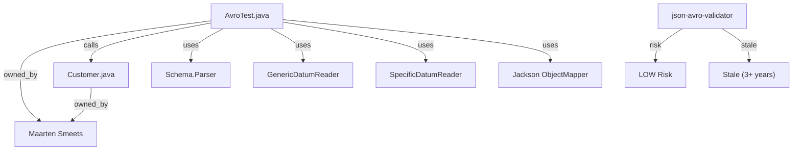

# Codebase Archaeology Report: kaushikTT/json-avro-validator

**Generated:** 2026-07-10T11:15:00Z
**Branch:** main
**Analysis Type:** full

---

## 1. Executive Summary

| Item | Value |
|---|---|
| Total Modules/Services | 1 |
| Primary Language | Java |
| Primary Framework | Apache Avro |
| Architecture Pattern | Single-module utility |
| Architectural Violations | 0 |
| Top Risk File | AvroTest.java (LOW) |
| ADRs Found | 0 |
| Commit History Window | 2022-01-27 (all commits in single day) |

---

## 2. Repository Metadata

| Field | Value |
|---|---|
| Repository | kaushikTT/json-avro-validator |
| Description | Sample on how to validate JSON against an AVRO file in Java and get usable feedback |
| Default Branch | main |
| Languages | Java |
| Topics | — |
| License | MIT License |
| Created | 2022-03-07T10:16:29Z |
| Last Updated | 2022-01-27T12:43:28Z |

---

## 3. Technology Stack

| Category | Technologies |
|---|---|
| Languages | Java 17 |
| Frameworks | Apache Avro 1.11.0 |
| Build Tools | Maven |
| Infrastructure | — |
| Test Frameworks | — |

---

## 4. Module / Service Map

| Module | Path | Language | Framework | Description |
|---|---|---|---|---|
| json-avro-validator | / (root) | Java | Apache Avro | Sample on how to validate JSON against an AVRO file in Java |

---

## 5. Architecture Pattern and Layer Map

**Identified Pattern:** Single-module utility application
**Evidence:** Single source directory with one entry point (AvroTest.java main method), no layered architecture, no service boundaries.

### Layer Map

| Layer | Files |
|---|---|
| Application Entry | src/main/java/AvroTest.java |
| Domain Model | src/main/java/com/demo/avro/Customer.java (Avro-generated) |
| Resources | src/main/resources/file.avsc, src/main/resources/file.json |

---

## 6. Architectural Violations

No violations detected. This is a single-layer utility application with no inter-layer dependencies to violate.

---

## 7. Call Graph (Top Entry Points)

### AvroTest.main(String[] args)
- `Schema.Parser().parse(InputStream)` — Parses AVRO schema from file.avsc
- `GenericDatumReader(Schema)` — Creates generic reader for schema validation
- `DecoderFactory.get().jsonDecoder(Schema, InputStream)` — Decodes JSON against schema
- `SpecificDatumReader<Customer>` — Reads JSON into generated Customer class
- `ObjectMapper.readValue(InputStream, Class)` — Jackson deserialization
- `Customer.toByteBuffer()` — Validates serialized output against schema

---

## 8. Service-to-Service Dependencies

None. This is a standalone utility with no external service calls.

---

## 9. Event Flow Map

None. No event publishing or consumption patterns detected.

---

## 10. Ownership Map

| Module | Primary Owner | CODEOWNERS Entry | Commit Count | Last Modified |
|---|---|---|---|---|
| json-avro-validator | Maarten Smeets (maartensmeets) | No CODEOWNERS file | 5 | 2022-01-27 |

---

## 11. Ownership Gaps

| Module | Risk Type | Details |
|---|---|---|
| json-avro-validator | Single Owner | Only contributor: Maarten Smeets |
| json-avro-validator | Stale | No commits since 2022-01-27 (3+ years) |

---

## 12. High-Churn Files (Top 20)

| File | Commit Count | Distinct Authors | Churn Level |
|---|---|---|---|
| src/main/java/AvroTest.java | 3 | 1 | LOW |
| README.md | 2 | 1 | LOW |
| pom.xml | 1 | 1 | LOW |

Note: With only 5 total commits, no files qualify as HIGH churn.

---

## 13. Scar-Tissue Analysis (CRITICAL and HIGH)

No scar tissue detected. No commits contain revert, hotfix, rollback, or emergency keywords.

| File | Revert Count | Hotfix Count | Score | Risk Level |
|---|---|---|---|---|
| (none) | 0 | 0 | 0 | LOW |

---

## 14. Pre-Edit Risk Warnings

No high-risk files identified. All files are LOW risk.

---

## 15. Decision Intelligence

### Architecture Decision Records

No ADR files found in the repository (checked: docs/adr, docs/decisions, adr).

### Notable Pull Requests

No pull requests found in this repository.

---

## 16. Knowledge Graph

---

## 17. Analysis Metadata

| Field | Value |
|---|---|
| Analysis Timestamp | 2026-07-10T11:15:00Z |
| Analysis Type | full |
| Repository | https://github.com/kaushikTT/json-avro-validator |
| Branch | main |
| Total MCP Calls | 7 |
| Analysis Duration | ~30s |
| Artifacts Pushed To | codebase_archaeology/ in branch main |
